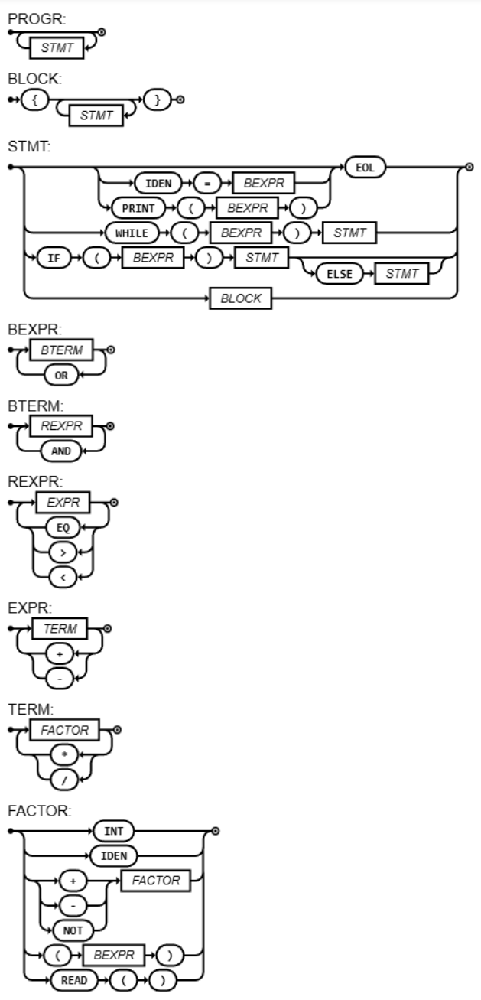

# Compilador

[](https://compiler-tester.insper-comp.com.br/svg/garciapp2/compilador)



## EBNF

```ebnf
PROGRAM = { STATEMENT } ;
BLOCK = "{", { STATEMENT }, "}" ;
STATEMENT = ((LET, (MUT | ε), IDENTIFIER, ":", TYPE, ("=", BOOLEXPRESSION | ε)) | (IF, "(", BOOLEXPRESSION, ")", STATEMENT, ("ELSE", STATEMENT) | ε) | (WHILE, "(", BOOLEXPRESSION, ")", STATEMENT) | (FOR, "(", IDENTIFIER, "=", BOOLEXPRESSION, ";", BOOLEXPRESSION, ";", IDENTIFIER, "=", BOOLEXPRESSION, ")", STATEMENT) | (IDENTIFIER, "=", BOOLEXPRESSION) | (PRINT, "(", BOOLEXPRESSION, ")") | BLOCK | ε), EOL ;
BOOLEXPRESSION = BOOLTERM, { "||", BOOLTERM } ;
BOOLTERM = RELEXPRESSION, { "&&", RELEXPRESSION } ;
RELEXPRESSION = EXPRESSION, { ("==" | "<" | ">"), EXPRESSION } ;
EXPRESSION = TERM, { ("+" | "-"), TERM } ;
TERM = FACTOR, { ("*" | "/"), FACTOR } ;
IFEXPRESSION = IF, BOOLEXPRESSION, "{", BOOLEXPRESSION, "}", ELSE, "{", BOOLEXPRESSION, "}" ;
FACTOR = IFEXPRESSION | ("+" | "-" | "!"), FACTOR | "(", BOOLEXPRESSION, ")" | NUMBER | BOOL | STRING | IDENTIFIER | READ, "(", ")" ;
NUMBER = DIGIT, { DIGIT } ;
DIGIT = 0 | 1 | ... | 9 ;
IDENTIFIER = LETTER, { LETTER | DIGIT | "_" } ;
LETTER = a | b | ... | z | A | B | ... | Z ;
BOOL = "true" | "false" ;
TYPE = "i32" | "bool" | "str" ;
STRING = "\"", { CHAR }, "\"" ;
```

## Base de Testes Sugerida (Roteiro 7)

```rust
// 1) Variaveis de todos os tipos
let mut a: i32 = 2;
let b: bool = true;
let mut s: str = "oi";
s = s + "!";
println!(a + 3);     // 5
println!(b);         // true
println!(s);         // oi!

// 2) Compatibilidade com programa antigo
i = 1;
n = 5;
f = 1;
while (i < n || i == n) {
  f = f * i;
  i = i + 1;
}
println!(f);         // 120

// 3) Operacao com tipos incorretos (deve falhar)
// let x: i32 = "abc";

// 4) If com string de entrada
let inp: str = scanln!();
if (inp == "go") {
  println!("ok");
} else {
  println!("no");
}
```
